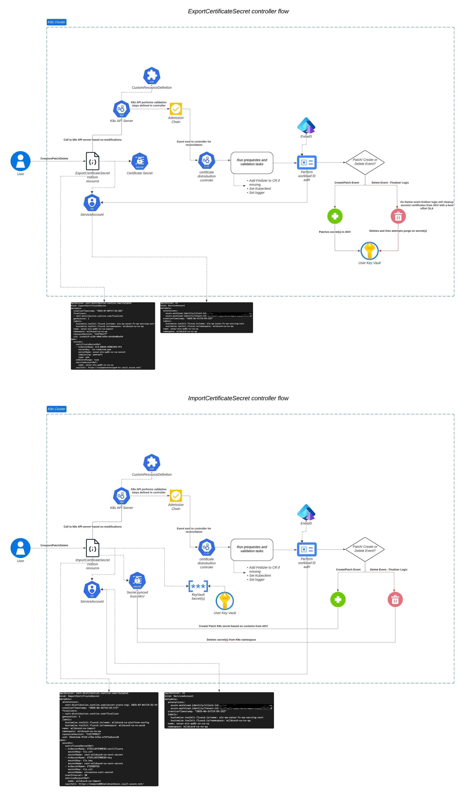

# External Certificate Operator

## External Certificate Operator is designed to export/import certificates issued by Cert Manager to and from a cluster while using Azure KeyVault as the central location for certificate storage

### High Level Architecture



#### So how does it work?

**Steps 4 to 7 will continue flow throughout the lifecycle of the certificate from updates to renewal making sure your certificate secrets are always available in your Azure KeyVault**

1. User defines there certificate and export certificate secret manifest in there assigned namespace on the EACM platform
2. Manifests are deployed by the Kubernetes platform
3. Cert Manager assess your manifest based on your specified attributes and submits a request for validation against [policy](https://canadian-tire.atlassian.net/wiki/spaces/CDCC/pages/2961343457/Certificate+Policy) in your namespace
4. Once approved Cert Manager creates a certificate based on your specified attributes
5. Cert Manager then makes a call to the Venafi TPP platform to sign the private key of said certificate
6. Cert Manager creates a secret local to the Kubernetes platform containing your certificate and private key
7. The Export Certificate Operator will then copy the contents of the secret and place it in your Azure KeyVault based on the attributes in your export certificate secret manifest defined in step 1

### Contributing

The project includes a set of bash scripts which focuses on easily spinning up and down a testing environment for the operator. All scripts sit under `integration/scripts`

#### Pipelining

- Azure Pipelines upon merging feature branch into main will build and push both the Helm Chart and Container images to Artifactory.
- Jfrog Xray scanning on operator container is done once a PR is created for a given feature

### CRD Api Docs

`api/v1alpha1/docs/external-certificates-operator.io.md`

#### ExportCertificateSecret spec

ExportCertificateSecret will pickup a given set of `crt` certificate and key values from a k8s secret created by Cert Manager and push said secrets to an Azure Key Vault. Authentication via an annotated service account reference by name in ExportCertificateSecret authenticated via workload identity

#### ImportCertificateSecret spec

ImportCertificateSecret will pull down a given set of secrets from Azure KeyVault and create a k8s secret in a given namespace where ImportCertificateSecret is created with its contents being the specified destinationKeyName. Authentication via an annotated service account reference by name in ExportCertificateSecret authenticated via workload identity.

### Architecture decisions

#### Time delay reconciliation

K8s controllers run on standard reconciliation loops based on defined time delays/ event triggers in the cluster. Both the `ExportCertificateSecret` and `ImportCertificateSecret` controllers respond to secrets based events in the k8s cluster along with a standard time interval (ie. defaults to 30 minutes can be adjusted by user) to check for changes in Azure KV.

However the real world is hardly perfect and errors do occur which is why both controllers implement an exponential time delay backoff until a max of 30 minutes to prevent exhaustion of requests/ resources.

- *Retry Event from unknown error* - Controllers will retry at the below interval indefinitely until user corrects error

First Retry: (2 minutes)
Second Retry: (4 minute)
Third Retry: (8 minutes)
Fourth Retry: (16 minutes)
Fifth Retry: (32 minutes, but capped at 30 mins)

### Reconcile conditions

#### `ExportCertificateSecret`

- `Create, Update, Delete` of the `ExportCertificateSecret` object
- `Create, Update` of the target secret defined in `ExportCertificateSecret` object

#### `ImportCertificateSecret`

- `Create, Update, Delete` of the `ImportCertificateSecret` object
- `Create, Update, Delete` of the target secret defined in `ImportCertificateSecret` object
- `Time based` reconciles every x minutes defined in `scanInterval` attribute in the `ImportCertificateSecret` object, this is outside of the normal lifecycle reconcile events

### Finalizers

Finalizers are implemented for both controllers to cleanup secrets created by the controller itself during a given lifecycle event

- `ExportCertificateSecret` finalizers will cleanup all secrets created in Azure KV for a given spec in Azure KV
- `ImportCertificateSecret` finalizers will cleanup all secrets created in k8s for a given spec in Azure KV

### Creation of k8s TLS secrets

The `ImportCertificateSecret` spec will create a given k8s secret based on defined options, The secret type creates is of `kubernetes.io/tls` which requires a minimum of 2 key value pairs `tls.crt` and `tls.key` in order to have the secret accepted and created by the k8s api. Because of this users may find only defining a spec like that of below will result in some empty key value pairs which in this case is completely be design.

```yaml
apiVersion: external-certificate.io/v1alpha1
kind: ImportCertificateSecret
metadata:
  name: import
  namespace: foo-ns
spec:
  azurekv:
    vaultUrl: https://foo-kv.vault.azure.net/
    scanInterval: 1
    serviceAccountRef:
      name: coareport01-svc-0000-shd-sa
    certificateSecretRef:
      - kvSecretName: report-01-cert-secret-pem
        secretName: report-01-cert-secret-import
        secretKey: tls-combined.pem
```

```json
$ k get secret sample -n foo -o json | jq
{
  "apiVersion": "v1",
  "data": {
    "tls-combined.pem.crt": "ABCD.................123456",
    "tls.crt": "",
    "tls.key": ""
  },
  "kind": "Secret",
  "metadata": {....},
  "type": "kubernetes.io/tls"
}
```

### To Do

- E2E testing
- Implement new eventhandler logic in ImportCertificateSecret controller logic, currently only used in Export
- Metrics
