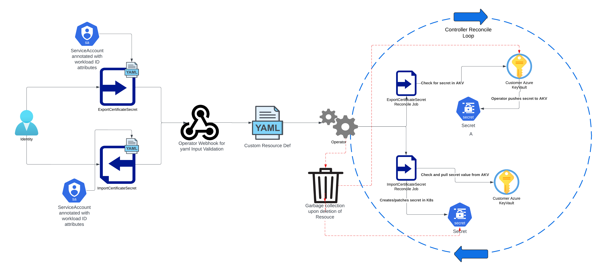

# External Certificate Operator

## External Certificate Operator is designed to export/import certificates issued by Cert Manager to and from a cluster while using Azure KeyVault as the central location for certificate storage

### Use Cases

- Exporting PEM/P12 certificate formats (any format supported by Cert-Manager) to AKV defined from given namespace in a centralized and dedticated Cert Manager cluster
- Importing certificate secrets into a namespace from AKV as a k8s secret. Destination namespace outside of where the `ImportCertificateSecret` manifest can be defined for use cases where secrets must sit in a certain NS for ingress .. etc (ie. Istio)

#### Why not use External Secrets Operator?

ESO is great highly regarded and CNCF adopted technology and such be primiarly considered as a first choice for secrets lifecycling to and from a k8s clutser
However it does have it limits when it comes to secret lifecyling for secrets into Azure Key Vault spefically regarding AKV required PEM/P12 formats. Something else to consider is tool strawl as well in your clutser, installing 3 tools to get the job done and having to keep 3 tools happy is usally considered a higher operational burden than a tools that less feature rich however fits the requiremnts of a given role.
The repo also servers a personal challenge to myself to gain more insight into the internal workings of k8s.

### High Level Architecture



### Contributing

The project includes a set of bash scripts which focuses on easily spinning up and down a testing enviroment for the oprator. All scripts sit under `integration/scripts`

#### Docker Build and Push

The DockerBuild and push script located at `integration/scripts/docker-build-push.sh` will build, log into ACR and push image to ACR for consumption by AKS cluster

`./integration/scripts/docker-build-push.sh -r fooacr -i caas-certificate-distribution-operator -t 0.1.0`

#### Operator deployment rollout

The Operatore rollout script `integration/scripts/rollout-new-controller-ver.sh` will perform a rollout restart on the Operator deployment manifest to force the recreation of the operator pods in turns pulling down the latest version of the operator image from ACR. It best to tie this into your docker build push command ... see below

`./integration/scripts/docker-build-push.sh -r fooacr -i caas-certificate-distribution-operator -t 0.1.0 && ./integration/scripts/rollout-new-controller-ver.sh -n cert-dist-op-ns -d caas-certificate-distribution-operator-controller-manager`

#### Infra setup

Infra setup bash script will run all three Terraform workspaces under `integration/scripts/env-setup.sh`

- `integration/terraform/infra`
- `integration/terraform/cert-manager`
- `integration/terraform/operator`

The infra workspace requires the dev define there Entra ID object ID to give them Admin access to the destionation Azure KeyVault for validation during testing `var.LOCAL_DEV_USER_OBJECT_ID`

If chnages to the helm charts are made and validation of said changes are required post init deployment the version of the helm chart defined in `Chart.yaml` must be chnaged in order for the helm TF provider to pickuo chnages and redploy.

#### Pipelining

- Azure Pipelines upon merging feature branch into main will build and push both the Helm Chart and Container images to Artifactory.
- Jfrog Xray scanning on operator container is done once a PR is created for a given feature

### CRD Api Docs

`api/v1alpha1/docs/external-certificate.io.md`

#### ExportCertificateSecret spec

ExportCertificateSecret will pickup a given set of `crt` certificate and key values from a k8s secret created by Cert Manager and push said secrets to an Azure Key Vault. Authentication via an annotated service account reference by name in ExportCertificateSecret authenticated via workload identity

More examples can be found at `/config/samples/cert-distribution_v1alpha1_exportcertificatesecrets.yaml

#### ImportCertificateSecret spec

ImportCertificateSecret will pull down a given set of secrets from Azure KeyVault and create a k8s secret in a given namespace where ImportCertificateSecret is created with its contents being the specified destinationKeyName. Authentication via an annotated service account reference by name in ExportCertificateSecret authenticated via workload identity.

More examples can be found at `/config/samples/cert-distribution_v1alpha1_importcertificatesecrets.yaml`

### Architecture decisions

#### Time delay reconciliation

K8s controllers run on standard reconciliation loops based on defined time delays/ event triggers in the cluster. Both the `ExportCertificateSecret` and `ImportCertificateSecret` controllers respond to secrets based events in the k8s cluster along with a standard time interval (ie. defaults to 30 minutes can be adjusted by user) to check for changes in Azure KV.

However the real world is hardly perfect and errors do occur which is why both controllers implement an exponential time delay backoff until a max of 30 minutes to prevent exhaustion of requests/ resources.

- *DELETE Event* - Controllers will retry at the below interval before deciding to drop process and continue without 100% cleanup

First Retry: (30 seconds)
Second Retry: (1 minute)
Third Retry: (2 minutes)
Fourth Retry: (4 minutes)
Fifth Retry: (8 minutes)

- *NORMAL Retry Event from unknown error* - Controllers will retry at the below interval indefinitely until user corrects error

First Retry: (2 minutes)
Second Retry: (4 minute)
Third Retry: (8 minutes)
Fourth Retry: (16 minutes)
Fifth Retry: (32 minutes, but capped at 30 mins)

### Finalizers

Finalizers are implemented for both controllers to cleanup secrets created by the controller itself during a given lifecycle event

- `ExportCertificateSecret` finalizers will cleanup all secrets created in Azure KV for a given spec in Azure KV
- `ImportCertificateSecret` finalizers will cleanup all secrets created in k8s for a given spec in Azure KV

### Creation of k8s TLS secrets

The `ImportCertificateSecret` spec will create a given k8s secret based on defined options, The secret type creates is of `kubernetes.io/tls` which requires a minimum of 2 key value pairs `tls.crt` and `tls.key` in order to have the secret accepted and created by the k8s api. Because of this users may find only defining a spec like that of below will result in some empty key value pairs which in this case is completely be design.

```yaml
apiVersion: external-certificate.io/v1alpha1
kind: ImportCertificateSecret
metadata:
  name: import
  namespace: foo-ns
spec:
  azurekv:
    vaultUrl: https://foo-kv.vault.azure.net/
    scanInterval: 1
    serviceAccountRef:
      name: coareport01-svc-0000-shd-sa
    certificateSecretRef:
      - kvSecretName: report-01-cert-secret-pem
        secretName: report-01-cert-secret-import
        secretKey: tls-combined.pem
```

```json
$ k get secret sample -n foo -o json | jq
{
  "apiVersion": "v1",
  "data": {
    "tls-combined.pem.crt": "ABCD.................123456",
    "tls.crt": "",
    "tls.key": ""
  },
  "kind": "Secret",
  "metadata": {....},
  "type": "kubernetes.io/tls"
}
```

### To Do

- E2E testing
